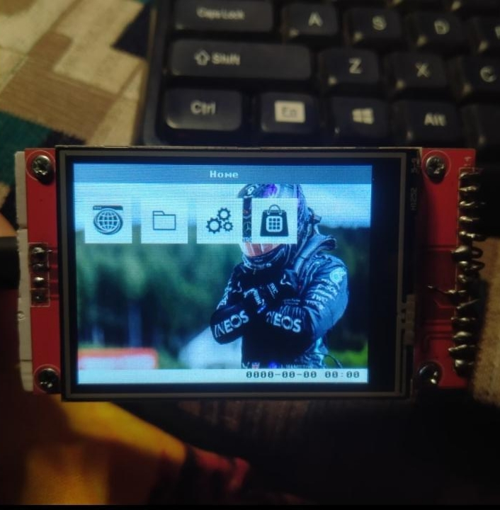
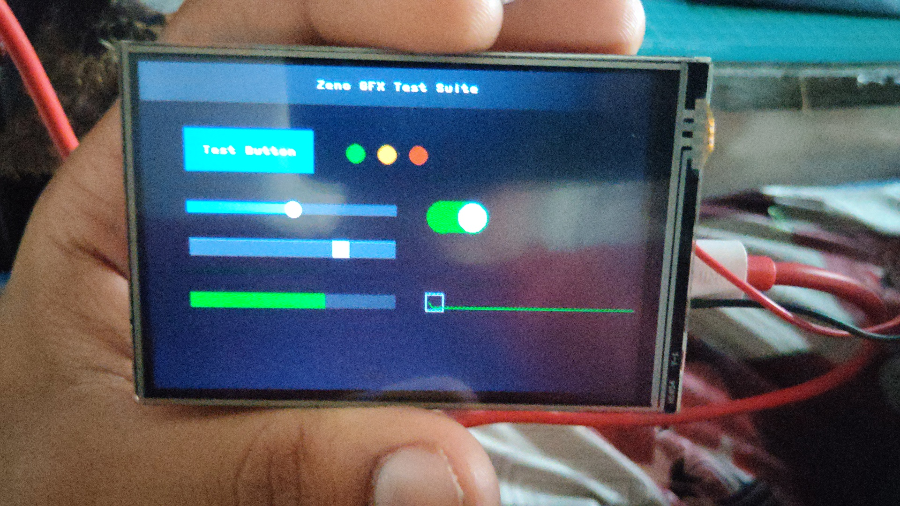
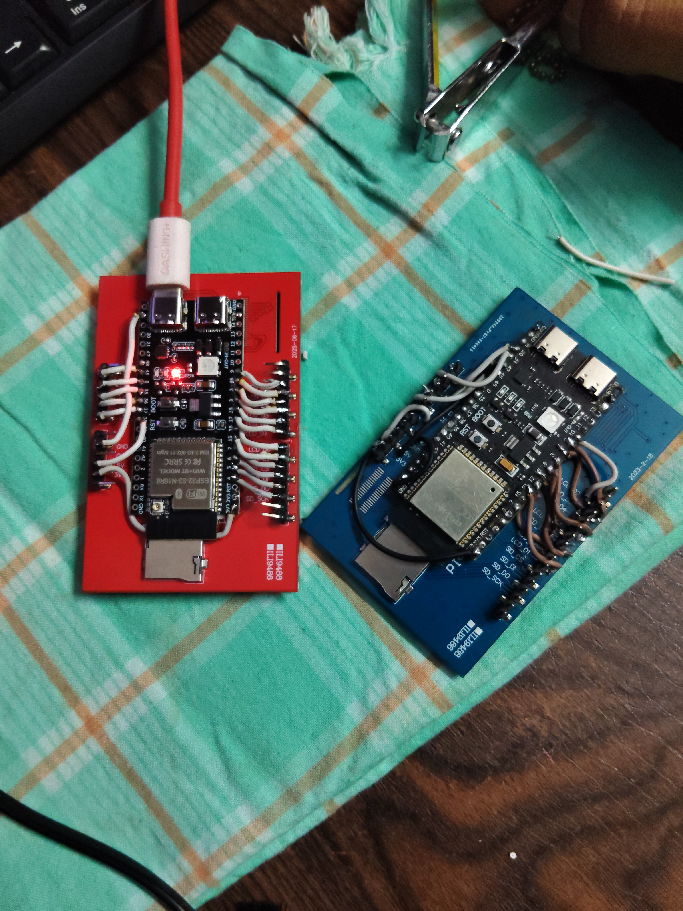
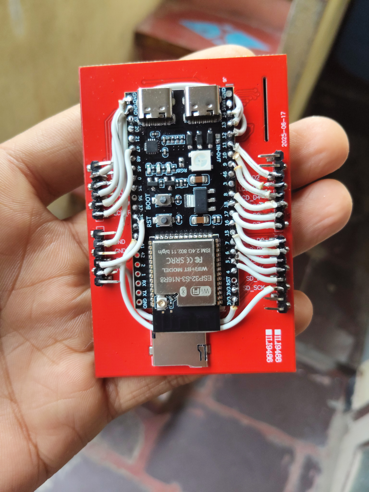

# Zeno OS

**A sandboxed, edge-computing operating system for constrained microcontroller platforms.**

Zeno OS is a solo research and engineering project exploring how far a general-purpose,
multi-application OS experience — process-like isolation, a hierarchical filesystem, a
POSIX-flavored shell, a graphical desktop, package management, and networked services —
can be pushed onto a single System-on-Chip with kilobytes, not gigabytes, of usable RAM.

It currently targets the **Espressif ESP32-S3** (ESP32-S3-N16R8: dual-core Xtensa LX7,
16 MB flash, 8 MB PSRAM) running a MicroPython execution core on top of ESP-IDF, driving
an ILI9488/ILI9341-class parallel LCD panel with resistive/capacitive touch.

Zeno OS was first presented publicly as *"Zeno OS: A Sandboxed Edge Computing Platform
for ESP32"* at the Sri Chandrasekharendra Saraswathi Viswa Mahavidyalaya (SCSVMV)
engineering symposium.

> **Author:** Marthi Venkata Shanmukha Viswanadh — Sole Architect & Developer
> *Independent embedded systems research*

---

## Screenshots & Hardware

| | |
|---|---|
|  |  |
| Home screen — app grid, taskbar clock, and wallpaper rendered on the ILI9488-class reference panel (480×320, landscape). | The `Graphics.py` widget toolkit exercised by a test screen: buttons, status dots, sliders, a toggle switch, a progress bar, and an `IOSSlider`-style draggable knob. |
|  |  |
| Two generations of the ESP32-S3-N16R8 reference carrier board used for development, wired to the LCD/touch/SD header breakout. | Close-up of the carrier board: ESP32-S3-N16R8 module, RGB status LED, boot/reset buttons, and the LCD/SD ribbon header. |

---

## Table of Contents

1. [Design Philosophy](#design-philosophy)
2. [System Layering](#system-layering)
3. [Boot Process](#boot-process)
4. [Kernel Organization & Scheduling](#kernel-organization--scheduling)
5. [OS Services Subsystem](#os-services-subsystem)
6. [Storage Architecture](#storage-architecture)
7. [Graphics & Display Subsystem](#graphics--display-subsystem)
8. [Shell and Command Interface](#shell-and-command-interface)
9. [Application Layer & Sandboxing](#application-layer--sandboxing)
10. [Resilience and Fault Isolation](#resilience-and-fault-isolation)
11. [The SCPU/GCPU Dual-Domain Architecture (Roadmap)](#the-scpugcpu-dual-domain-architecture-roadmap)
12. [Repository Structure](#repository-structure)
13. [Development Workflow & Helper Scripts](#development-workflow--helper-scripts)
14. [Hardware Reference Platform](#hardware-reference-platform)
15. [References](#references)

---

## Design Philosophy

Four principles govern every architectural decision in Zeno OS:

1. **Fail-safe, layered boot.** The system never assumes its own previous boot succeeded
   cleanly. Multiple boot entry points exist precisely so that a corrupted or
   partially-written OS can still reach an interactive or recoverable state.
2. **Capability-gated authorization.** Privileged kernel code paths are only permitted to
   run once a single-use capability token has been minted and consumed, closing the door
   on stale or replayed boot state persisting across resets.
3. **Separation of logic from presentation.** System logic (scheduling, storage,
   networking, package management) is architecturally distinct from rendering and display
   composition — informal today, and being formalized into two dedicated execution domains
   (see [SCPU/GCPU](#the-scpugcpu-dual-domain-architecture-roadmap)).
4. **Disposable application execution.** Applications are not long-lived, kernel-tracked
   processes; they run inside a throwaway namespace that is unconditionally cleaned up, and
   their failure is always contained.

These principles trade raw throughput for predictability and resilience — an appropriate
trade on a platform where a hard fault means a physical device is unusable until reflashed.

---

## System Layering

Zeno OS is organized as a strict layered stack. Each layer only depends on the layer
directly beneath it; no layer reaches upward.

```
L6 — Applications (Home/APPS/*)
L5 — Shell / Interactive Layer (ZenCMD)
L4 — OS Services Layer (Services.py)
L3 — Kernel & Capability Layer
L2 — MicroPython VM + Native Extensions
L1 — ESP-IDF / FreeRTOS
L0 — Hardware (ESP32-S3, LCD, SD, RTC, radio)
```

- **L0/L1 — Hardware and vendor SDK.** ESP-IDF v5.5.x and FreeRTOS provide partitioning,
  low-level drivers (`esp_lcd` panel-IO, LEDC PWM, SPI/I2C, Wi-Fi/BT radio stacks), and the
  RTOS scheduler beneath MicroPython.
- **L2 — MicroPython VM and native extensions.** Two purpose-built native (C) MicroPython
  modules form the performance-critical boundary of the OS: `moclcd` (graphics/display
  driver) and the private `zfs` filesystem driver.
- **L3 — Kernel and capability layer.** Selects and executes one of several boot entry
  points and mints the single-use authorization capability consumed by the rest of boot.
- **L4 — OS Services.** The bulk of system logic: process/scheduling primitives, storage,
  networking, package/application management, diagnostics.
- **L5 — Shell.** `ZenCMD`, the interactive command interpreter.
- **L6 — Applications.** User-facing programs launched into disposable execution contexts.

---

## Boot Process

Zeno OS boots through one of several distinct entry points, selected by a boot flag rather
than a single fixed code path — a deliberate resilience decision so the device always has
a route back to an interactive or repairable state.

```
Power-on / Reset
   │
ESP-IDF init, partition table & mount
   │
Boot flag decision (kernel.c, undisclosed)
   │
kernel.c (default) | kernel.py | safe.py | recovery.py
   │
Mint & consume boot_cap capability
   │
Load Services.py (graceful degradation on failure)
   │
Attach ZenCMD shell
   │
Launch Home UI
```

### Boot Flags

| Flag | Role |
|---|---|
| `kernel.c` *(default, undisclosed)* | The compiled, non-Python kernel entry point that boots the system under normal operating conditions. Its internal control flow, initialization order, and capability-minting logic are proprietary and not described publicly. |
| `kernel.py` | A Python-level boot flag used to bring the system up while exercising the scheduler and UI stack directly against `Graphics.py`. Performs the same capability check as the native kernel and hosts the cooperative `Task`/scheduler primitives. |
| `safe.py` | A minimal, safe-mode boot flag. Brings up only the UI module, task manager, CPU accounting object, and network object against the compiled firmware extension module, exposing a sandboxed `launch_app()` entry point. Used when the normal boot path fails but the compiled firmware core is intact. |
| `recovery.py` / **Recovery flag** | A standalone, dependency-free path that imports nothing from `Services`, so it remains usable even if `Services.py` or `zeno.py` are missing or corrupted. One of several resilience mechanisms in the system, not the primary recovery story on its own. |

### Capability-Gated Authorization

Every Python-level boot flag performs the same check before proceeding: it reads a boot
capability token (`zeno.boot_cap`), verifies it is a non-zero integer minted for this boot
cycle, and immediately nulls it out (`zeno.boot_cap = None`) so it cannot be reused. Only
after this check does it set `zeno.authorized = True`. This capability is a fresh 32-bit
value drawn from `urandom` each time `zeno.py` is (re)written — it is not a static secret
and is not portable across boot cycles.

### Graceful Service Degradation

After a boot flag has run, `ZenCMD` attempts to import `Services` and `zeno` through a
re-import helper that first evicts any stale cached module, so files recently repaired by
recovery are actually picked up. If `Services` fails to import, every command that depends
on it is disabled rather than crashing the shell: a `_NullLogger` and `_FallbackZeno` stand
in for the missing objects, and the shell prints an explicit notice that the device is
running in a degraded mode, with `recover` offered as the way out. This pattern — *attempt,
degrade, offer a documented recovery path* — recurs throughout Zeno OS as a system-wide
property (see [Resilience and Fault Isolation](#resilience-and-fault-isolation)).

---

## Kernel Organization & Scheduling

The Python-level kernel flag (`kernel.py`) hosts Zeno OS's cooperative task scheduling
primitives. Because MicroPython on this target runs as a single-threaded VM, Zeno OS does
not attempt preemptive multitasking at the Python level; instead it schedules cooperatively
against a fixed frame budget, in the same spirit as a fixed-timestep game loop.

### Task Model

Each schedulable unit of work is a `Task` object with a fixed `__slots__` layout (`name`,
`func`, `mode`, `period`, `done`, `expected_us`, `meta`). The `meta` dictionary tracks an
exponentially-weighted moving average (α = 0.3) of observed execution time, sample count,
and observed min/max execution time in microseconds:

```
t̄ₙ = α · tₙ + (1 − α) · t̄ₙ₋₁
```

This running estimate lets the scheduler reason about whether a task will fit inside the
remaining frame budget *before* running it. The frame budget is fixed at `FRAME_MS = 16`
(a nominal 60 Hz cadence), with per-task execution time clamped between `MIN_US = 1000`
and `MAX_US = 500,000` to prevent a single misbehaving task from starving the frame.
Scheduler state is persisted to `/LOGS/task_state.json` so timing estimates survive a
reboot instead of re-learning from a cold start every time.

### Process Abstraction and CPU Accounting

The OS Services layer complements the kernel-level task scheduler with a heavier process
abstraction (`Process`, `ProcessError`, `PermissionDenied`, `Scheduler`) and privilege
enforcement (`SystemPrivilege`). Because MicroPython does not natively provide several
CPython exception types used for permission and filesystem semantics, Zeno OS defines
compatible shims (`PermissionError`, `FileNotFoundError`, `FileExistsError`,
`NotADirectoryError`).

A lightweight `CPU` object reports coarse utilization from busy/idle microsecond counters
supplied by the scheduler (`usage% = ⌊100 · busy/(busy + idle)⌋`, using integer math to
avoid floating-point overhead), and exposes `reboot()` as the single authoritative path to
`machine.reset()`.

### Power Management

A dedicated `PowerManagement` service manages CPU frequency scaling through
`machine.freq()`. It defines named frequency tiers (`low`/`normal`/`high`/`turbo`) per
platform, falling back to a single-level table built from the frequency observed at boot
on unrecognized platforms. Rather than measuring load itself, it exposes a boost/release
request model keyed by caller-supplied reason strings (e.g. a package download requesting
`high` until it completes), so callers explicitly request the performance they need and
the highest currently-requested tier wins.

---

## OS Services Subsystem

The OS Services layer is the largest single body of system logic in Zeno OS. It is
deliberately organized as a **flat collection of focused classes** rather than a single
monolithic manager, so that any one service can fail or be reloaded independently.

| Cluster | Services |
|---|---|
| Identity & Security | `SystemPrivilege`, `usermanager`, CPython-compatible exception shims |
| Storage & Filesystem | `Disk`, `FileManager`, `BootConfig` |
| Process & Scheduling | `Process`, `Scheduler`, `system`, `CPU`, `PowerManagement` |
| Networking & Connectivity | `Network`, `downloadhelper`, `Git`, `BluetoothManager`, `IoTManager`, `Device` |
| Software Management | `AppInstaller`, `AppDB`, `PackageManager`, `Wiki` |
| Diagnostics | `Logger` |

Services do not call one another directly through hard imports where it can be avoided;
instead, the shell layer holds references to each service object and mediates access, and
each service exposes a uniform `help()` method describing the commands it answers to. This
keeps individual services independently testable and independently reloadable (`reload` /
`reloadmodule` shell commands) without requiring a full device reboot.

`AppDB` and `AppInstaller` maintain the registry of installed applications (backed by
`/APPS/Data/appdb.json`); `PackageManager` and the `ZenStore` application build on top of
this registry and the networking cluster to fetch and install packages — one service among
peers, with no special authority over boot, scheduling, or storage.

---

## Storage Architecture

Zeno OS exposes **two architecturally distinct storage tiers**:

```
User-visible VFS (flash + SD card)  ──  FileManager / Disk  ──  os.listdir() / open()
Private zfs (LittleFS2, mutex-guarded) ──  import zfs (native)  ──  never in VFS namespace
```

### User-Visible Filesystem

The standard MicroPython VFS, backed by internal flash and an optional SD card, is
mediated by the `Disk` and `FileManager` services. This is the filesystem the shell,
application layer, and package manager operate against: the `/Home` tree, installed
applications, logs, and downloaded packages all live here and are visible to
`os.listdir()`/`open()` in the ordinary way. The reference platform wires the SD card over
SPI (`SCK = 40`, `MOSI = 6`, `MISO = 5`, `CS = 7`).

### Private Kernel Filesystem (`zfs`)

A second, private storage tier — internally named `zfs`, backed by LittleFS2 on a
dedicated flash partition — exists exclusively for OS-internal kernel state. It is never
mounted into the MicroPython VFS and is never visible through `os.listdir()` or `open()`;
it is reachable only via a dedicated native module (`import zfs`), which calls into a C
implementation (`zfs_lfs.c`) guarded by a FreeRTOS mutex around every operation. This
separation exists so that OS-internal state cannot be casually inspected, corrupted, or
shadowed by user-space file operations sharing the same path namespace as application data.
Per-file cache buffers are sized to the flash erase granularity (4 KB blocks, 256 B
program/read size), consistent with LittleFS2's requirement for wear-aware,
power-loss-resilient writes on raw NOR/NAND flash.

---

## Graphics & Display Subsystem

The current rendering path — running in production today, prior to completion of the
GCPU migration — consists of a Python widget toolkit (`Graphics.py`) built directly on top
of a native display driver module (`moclcd`).

### Native Display Driver (`moclcd`)

`moclcd` is a MicroPython C extension built on ESP-IDF's `esp_lcd` i80 (8080-style)
parallel panel-IO driver. It drives an ILI9488/ILI9341-class controller over an 8-bit
parallel bus (control lines RST/RS/WR/RD plus an 8-bit data bus and a PWM-driven backlight),
supporting both landscape (480×320) and portrait (320×480) orientation via a single
`madctl` parameter. Fill and blit operations stream through a DMA-capable buffer
(`heap_caps_malloc` with `MALLOC_CAP_DMA`) with a transaction queue depth of 10, allowing
several chunks of a frame to be in flight on the DMA engine at once rather than stalling
the CPU on each line. Text rendering reuses MicroPython's own 8×8 font table natively in
C, including a transparent-background mode that only touches foreground pixels.

### Widget Toolkit (`Graphics.py`)

`Graphics.py` is a thin, function-level pass-through onto `moclcd` rather than a
re-implementation: `draw_text8x8()` and `draw_bmp()` call directly into the native driver
instead of building an intermediate framebuffer in Python. On top of these primitives it
implements a conventional retained-mode widget set — `UIScreen`, `UIButton`, `UIText`,
`DialogBox`, `UIToggleSwitch`, `UISlider`, `UIListView`, `UITabBar`, `UICheckBox`,
`UIRadioGroup`, `VirtualKeyboard`, and screen-transition animators, roughly thirty widget
classes in total — decoupled from any specific touch driver through a single
`set_touch_handler(fn)` indirection point.

### Present-Day Inter-Subsystem Communication

In the current, single-process MicroPython architecture, subsystems communicate through a
shared module-level state object (`zeno`), which exposes a small set of well-known
attributes (`ui`, `tsk`, `log`, `net`, `usr`, `fm`, plus boot/authorization state). This is
an appropriate pattern for a single address space with no true concurrency, but it does not
scale to a design where rendering and system logic run as separated execution domains —
the motivation for the architecture described next.

---

## Shell and Command Interface

`ZenCMD` is the interactive command interpreter that sits at the top of the Python-level
stack, mediating access to every OS service. It implements a POSIX-flavored command
surface with statement separation (`;`), pipelines (`|`) with an output-capture object
standing in for each intermediate stage, environment variables/aliases, and command
history. A privilege model (`super`/`unsuper`) gates destructive or system-level commands,
and the interactive prompt reflects the current privilege state.

| Category | Representative commands |
|---|---|
| Filesystem | `ls`, `cd`, `mkdir`, `rmdir`, `rm`, `cp`, `mv`, `touch`, `cat`, `head`, `tail`, `find`, `which`, `stat`, `file` |
| Session & shell | `echo`, `env`, `export`, `alias`, `history`, `whoami`, `id`, `hostname` |
| System info | `version`, `uptime`, `date`, `time`, `df`, `du`, `free` |
| Process & service | `ps`, `kill`, `jobs`, `service`, `reload`, `reloadmodule` |
| Storage mount | `mount`, `mountzfs`, `sync` |
| Privilege & power | `super`, `unsuper`, `passwd`, `shutdown`, `reboot` |
| Diagnostics & recovery | `bootlog`, `log`, `recover` |

---

## Application Layer & Sandboxing

Applications live under `/Home/APPS` (e.g. `Browser`, `Files`, `Paint`, `Settings`,
`ZenStore`), registered through `AppDB` against `/APPS/Data/appdb.json` and installed
through `AppInstaller`/`PackageManager`.

Applications are **not** persistent, kernel-tracked processes. Launching an application
(`launch_app(name)`) reads the application's source file and executes it into a fresh,
throwaway globals dictionary rather than importing it as a module:

```python
# Disposable application execution (simplified from safe.py)
def launch_app(app_name):
    path = "/SYSTEM32/APPS/{}.py".format(app_name)
    gc.collect()
    app_globals = {"__name__": "__main__"}
    try:
        with open(path, "r") as f:
            exec(f.read(), app_globals)
    except Exception as e:
        # captured and logged, never silently swallowed
        ...
    finally:
        app_globals.clear()
        del app_globals
        gc.collect()
    raise SystemExit
```

Any exception raised by the application is caught, formatted, and logged rather than
propagated — so a defective application cannot bring down the shell or the boot session
that launched it. The `finally` block unconditionally clears the application's namespace
and forces a garbage collection pass regardless of whether the application succeeded,
failed, or exited normally, which matters on a platform where a leaked reference can
exhaust available RAM within a single session.

---

## Resilience and Fault Isolation

Resilience in Zeno OS is not the property of any single module; it is a pattern applied
consistently across layers:

- The **boot layer** offers multiple entry points rather than a single point of failure.
- The **shell** degrades gracefully rather than failing to start when `Services` cannot be
  loaded.
- The **application layer** contains failures inside a disposable namespace rather than
  letting them escape into shell or kernel state.
- A **standalone recovery utility** can rebuild the minimal set of core files needed to
  reach a working shell, independent of every other service, as a last-resort path when the
  above layers are themselves compromised.

---

## The SCPU/GCPU Dual-Domain Architecture (Roadmap)

Zeno OS is transitioning to a new internal architecture organized around two dedicated
**execution domains**: the **System CPU (SCPU)** domain and the **Graphics CPU (GCPU)**
domain.

```
┌────────────────────┐        Internal IPC        ┌────────────────────┐
│    SCPU domain     │   (proprietary — undisclosed) │    GCPU domain     │
│ Scheduling          │◄──────────────────────────►│ Rendering           │
│ Application mgmt.   │      bidirectional channel   │ Display composition │
│ Storage             │                              │ GUI rendering       │
│ Networking          │                              │ Graphics accel.     │
│ System logic        │                              │ Display mgmt.       │
└────────────────────┘                              └────────────────────┘
```

- **SCPU (System CPU)** owns all operating-system services: scheduling, application
  lifecycle management, storage, networking, IPC, and system logic generally — the
  architectural successor to the [OS Services](#os-services-subsystem) layer.
- **GCPU (Graphics CPU)** owns graphics rendering exclusively: display composition, GUI
  rendering, graphics acceleration, and display management — the architectural successor
  to the [rendering path](#graphics--display-subsystem) described above.

> **SCPU and GCPU are logical architectural domains, not separate physical processors.**
> They describe a separation of responsibility within the system, not a statement about
> silicon topology.

**Scope note:** the SCPU/GCPU codebase is proprietary and under active development. The
internal IPC protocol, message framing, synchronization primitives, cross-boundary
scheduling strategy, and the rendering pipeline internal to GCPU are intentionally not
disclosed here or in any companion document.

---

## Repository Structure

The Zeno OS project is divided across multiple independently developed and independently
versioned repositories, mirroring the domain separation above:

- **System repository** — SCPU-domain OS logic: services, kernel/boot flags, storage,
  networking, shell.
- **Graphics repository** — GCPU-domain rendering logic and the native display driver
  boundary.
- **Additional supporting repositories** — auxiliary tooling and reference material that
  does not belong inside either domain repository.

Splitting the project this way improves modularity, maintainability, and long-term
scalability: each repository can evolve, be reviewed, and be released on its own cadence
without forcing a lock-step release of the entire system.

---

## Development Workflow & Helper Scripts

A set of shell scripts and utilities support the development, compilation, testing,
packaging, and flashing of Zeno OS. **These are development-time helper scripts and are
explicitly not part of the operating system architecture** — they do not run on the
device as part of Zeno OS, are not loaded by any boot flag, and are not addressable from
the shell or any OS service.

- **Build automation** — cross-compilation driver scripts that invoke the
  MicroPython/ESP-IDF toolchain (menuconfig automation, board variant selection, firmware
  image assembly).
- **Flashing utilities** — scripts that invoke `esptool`-style flashing against the target
  board's serial/USB interface.
- **Directory/staging management** — utilities that assemble the on-device filesystem
  image from the source tree ahead of flashing.
- **Device-side patch agent** (`zenpath.py`) — a small serial-protocol listener that
  applies line-based patches to files already on the device during iterative development,
  so a developer can push a targeted fix without reflashing the full image. This is a
  development bridge tool, not a general-purpose runtime IPC mechanism.

---

## Hardware Reference Platform

The reference platform for Zeno OS is an **ESP32-S3-N16R8** module (dual-core Xtensa LX7,
16 MB flash, 8 MB PSRAM, integrated Wi-Fi/Bluetooth radio) paired with an
ILI9488/ILI9341-class 8080-parallel LCD panel and resistive/capacitive touch input.

| Signal | GPIO | Signal | GPIO |
|---|---|---|---|
| RST | 12 | BL (backlight) | 38 |
| RS / DC | 13 | SD_SCK | 40 |
| WR | 14 | SD_MOSI | 6 |
| RD | 41 | SD_MISO | 5 |
| D0–D7 | 16, 15, 11, 10, 9, 4, 18, 17 | SD_CS | 7 |

Keeping the LCD panel and its header pinout constant across carrier-board revisions is
what allows a single native driver module (`moclcd`) to serve multiple hardware
generations without a compatibility layer.

---

## Conclusion & Roadmap

Zeno OS is architected as a layered, fail-safe system: a capability-gated boot sequence
that can fall back through multiple entry points, a services layer organized as
independently reloadable peers rather than a single privileged manager, a two-tier
storage model that keeps kernel state out of the user-visible filesystem, and an
application model in which every launched program runs inside a disposable, cleaned-up
execution context.

The project's near-term roadmap is the formalization of this architecture's implicit
logic/rendering separation into two dedicated execution domains — **SCPU** and **GCPU** —
communicating over an internal IPC mechanism. Consistent with the project's current stage
of development, this document has intentionally stopped short of describing the internal
protocol, scheduling strategy, or rendering pipeline that will connect those two domains,
as that work is proprietary and still under active development.

---

## References

1. Espressif Systems, *ESP-IDF Programming Guide, v5.5.x*, Espressif Systems, 2025.
2. D. George *et al.*, *MicroPython Documentation*, micropython.org, 2025.
3. C. Haster, *LittleFS: A Little Fail-Safe Filesystem Designed for Microcontrollers*, ARM Ltd., 2017.
4. ILI Technology Corp., *ILI9488/ILI9341 TFT LCD Single Chip Driver Datasheet*.

---

<sub>Adapted from the internal technical architecture specification *"Zeno OS: A Sandboxed
Edge-Computing Operating System for Constrained Microcontroller Platforms"* (Doc. No.
ZOS-ARCH-002, Rev. 2.0). Portions of the SCPU/GCPU dual-domain architecture are proprietary
and under active development, and are intentionally abstracted in this document.</sub>
